# TDD80 Public UI Visual Review

Date: 2026-07-22

## Verdict

The earlier minimal validation UI was not a valid 2.2.4 parity target. It has
been replaced by the production screen structure. The checked images below are
the current branch-only regression evidence; they are not release evidence for
the still-incomplete real diagnosis pipeline.

The second parity pass was measured against the released implementation rather
than the first public mock. The reference sources were the 2.2.4 private
`ResultStatusCell`, `ResultTitleCell`, `ResultDateCell`, `ResultTabCell`,
`ResultItemCell`, `TTFlashWarningAlertViewController`, their XIB constraints,
and the EN/KO/JA string catalogs. This corrected the following material drift:

- flash popup width `315pt`, corner radius `33pt`, exact 2.2.4 copy, 18/13/11pt
  typography, 80pt toggle row, and 50pt primary action;
- result status board `212×86pt`, three `56pt` circles with `7pt` spacing;
- symptom row `50pt`, centered when it fits, with `27pt` chips and a visible
  one-point frame on every unselected chip;
- result images `130×130pt`, `25pt` spacing, 26pt captions, and the original
  card/header spacing.

## Camera

| Light host | Dark host |
| --- | --- |
| 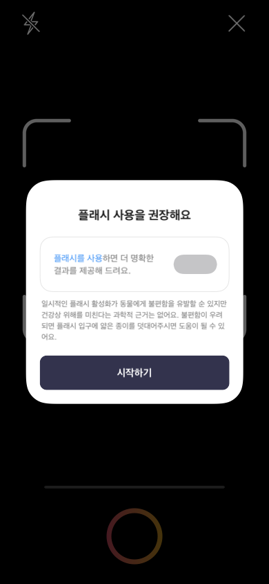 |  |
| 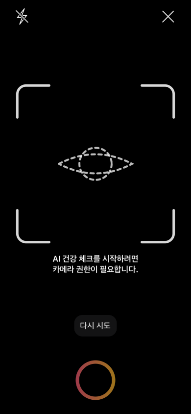 |  |

Restored production elements:

- flash control at top-left and close control at top-right;
- part-specific guide drawing, including the eye guide;
- flash recommendation, toggle, caution copy, and start action;
- album entry after starting, capture ring, progress, and retry states;
- fixed-dark rendering regardless of host appearance.

## Result

| Standard text | Accessibility text |
| --- | --- |
| 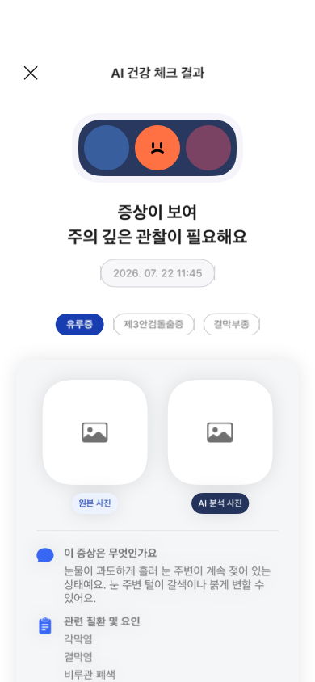 | 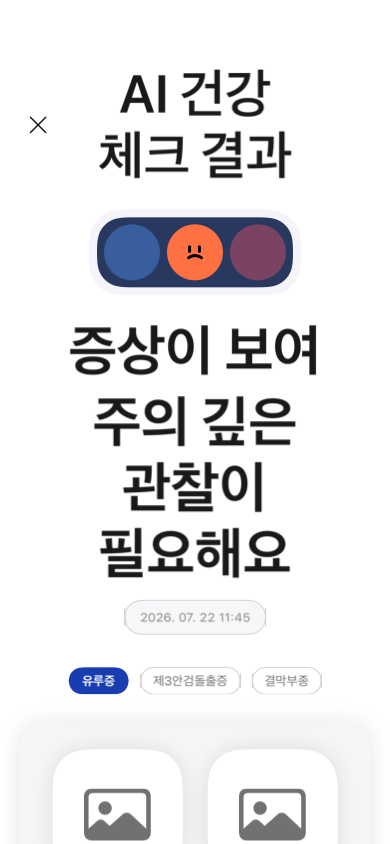 |
| 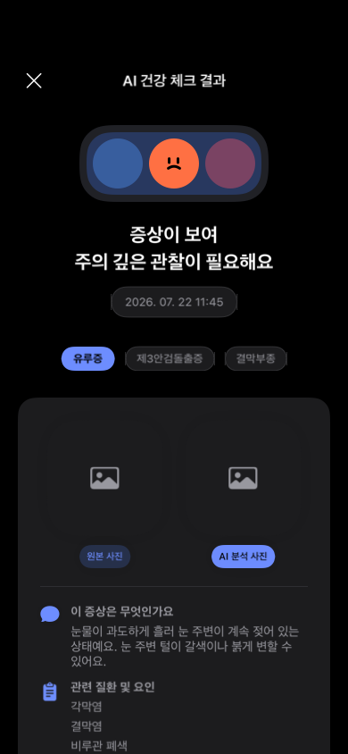 | 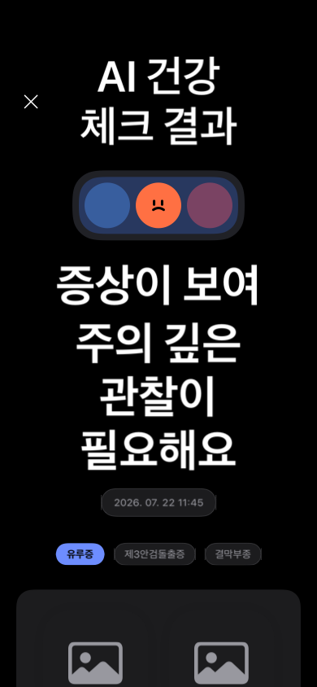 |

Restored production elements:

- close control and `AI 건강 체크 결과` title;
- three-state status board, headline, guidance, and date capsule;
- selected and framed unselected symptom tabs;
- original/analysis image pair with the approved `원본 사진` and
  `AI 분석 사진` captions;
- display-safe symptom description, related-condition, home-care, veterinary,
  and notice section layout;
- adaptive dark colors without changing the approved light palette.

## Full Validation Host

| Korean light | Korean dark |
| --- | --- |
| 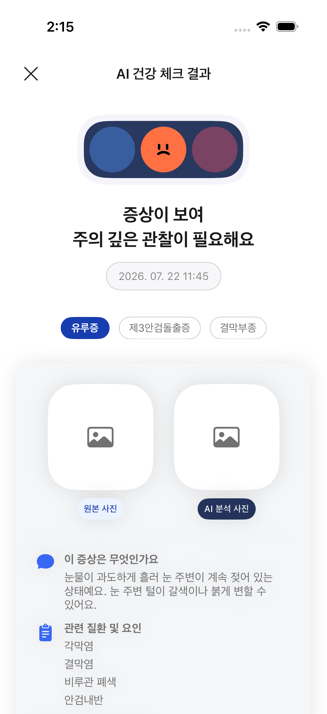 | 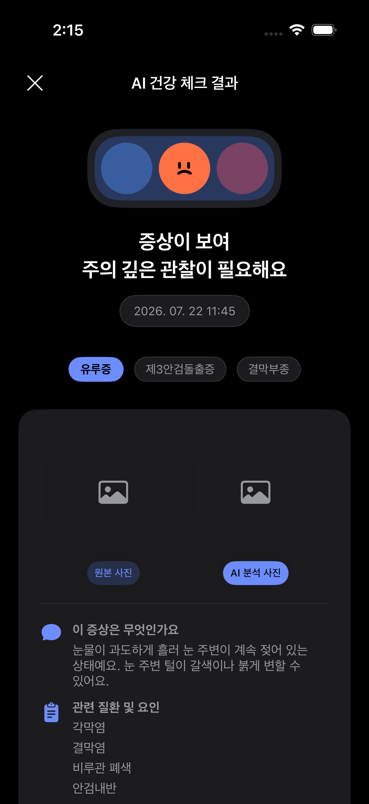 |

| English light | Japanese light |
| --- | --- |
| 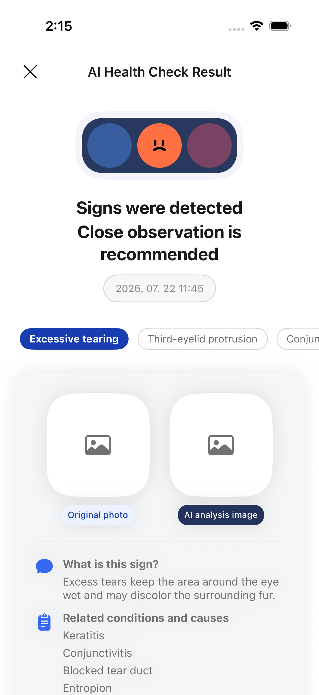 | 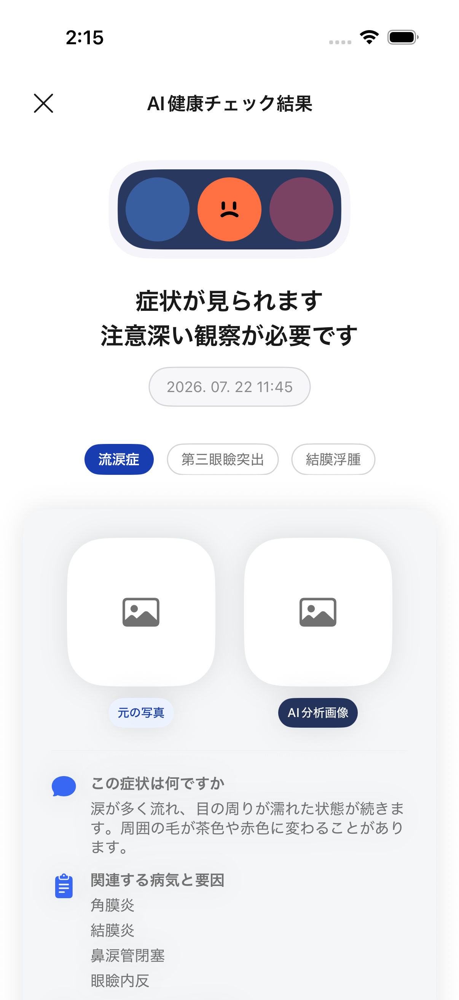 |

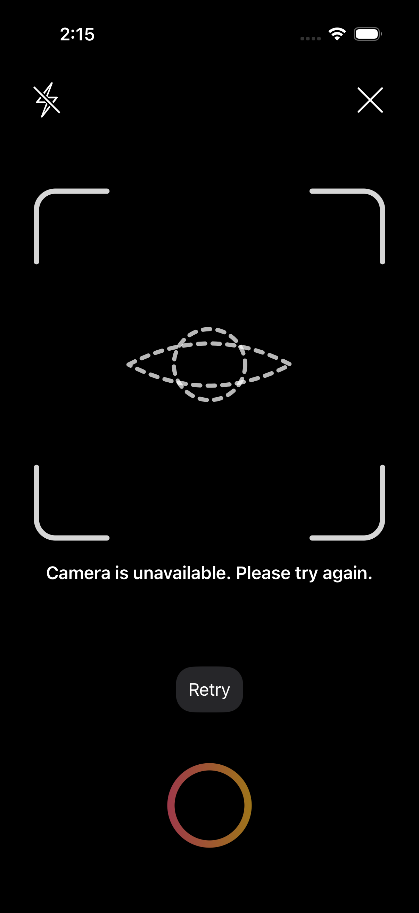

## Light-Mode Regression Contract

The following are intentional invariants and are covered by tests:

- result background remains `#FFFFFF`;
- result card remains `#F5F6F8`;
- primary result text remains `#191919`;
- every unselected symptom tab has a visible one-point border;
- `원본 사진` and `AI 분석 사진` remain separate localization keys;
- camera light-host and dark-host renders are byte-identical.

## Remaining Release Evidence

- real encrypted-model capture and album diagnosis;
- real original/analysis image URLs populated by Core;
- Core-supplied display-safe detail sections instead of deterministic sample
  content;
- production motion/resource parity for the original result Lottie and
  per-part camera guide assets, rather than the current source-only drawings;
- the selectable-skin, timeout, questionnaire, and other part-specific camera
  states that are not present in this validation host;
- physical-device screenshots for live preview, capture, progress, result,
  dismissal, English, and Japanese;
- final side-by-side approval against the released 2.2.4 application.
